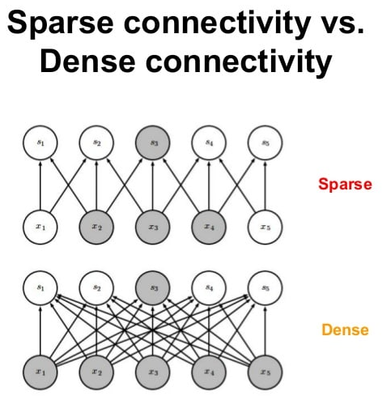
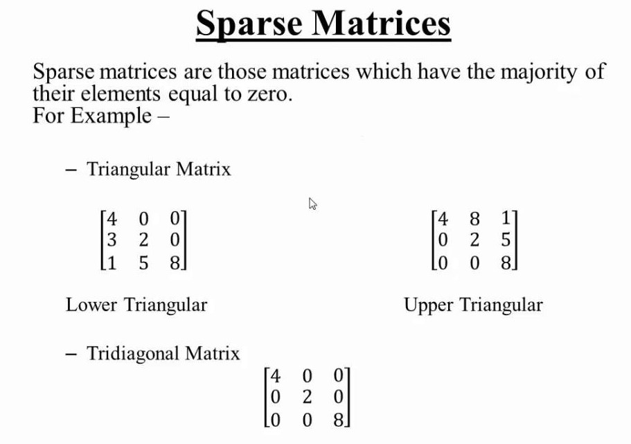
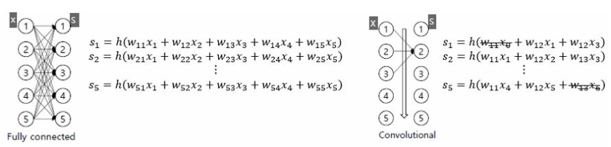
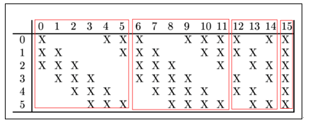
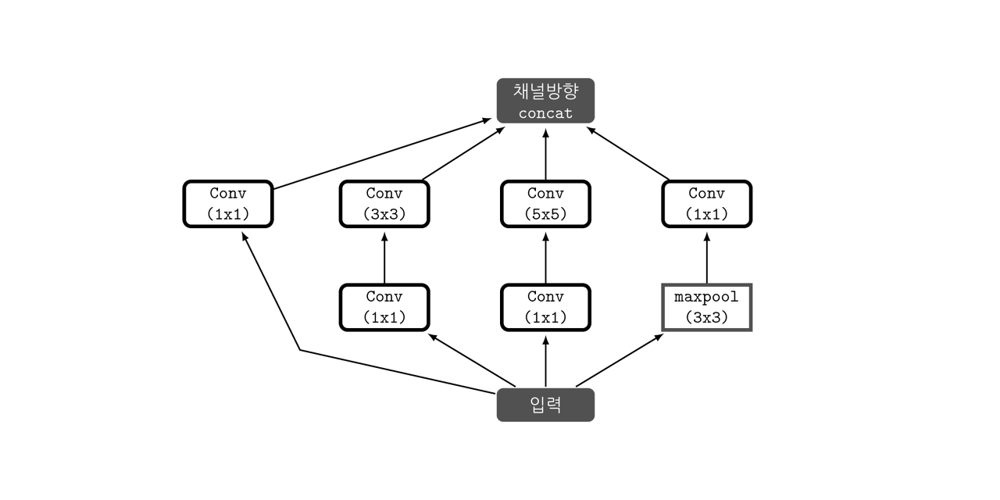

## Q & A
 
### Q) Inception module에서 병렬적인 filter들을 하나로 합칠 때 zero padding을 사용하나요?
> #### A) tensor를 하나로 합쳐주는 연산이므로 zero padding을 사용하지 않습니다.
> 
> - **padding의 의미**:   
>   padding은 CNN에서 kernel에 의해 이미지를 처리할 때 추가한 pixel   
> 
> - 공식 문서(pytorch 문서)에서 논문 구현에 torch.cat의 함수를 사용하고 있으며 이는 tensor들을 하나로 합쳐서 사용해주는 역할을 한다. 비슷한 기능을 하지만 다른 자료구조를 합쳐주는 함수로는 `pd.concat`와 `np.concatenate`가 있다.
> <br>
>   [참고]
>   
> - [What is Padding in Machine Learning?](https://deepai.org/machine-learning-glossary-and-terms/padding)
> - [googlenet.py](https://github.com/pytorch/vision/blob/master/torchvision/models/googlenet.py)
> - [TORCH.CAT](https://pytorch.org/docs/stable/generated/torch.cat.html)

----

### Q) Sparse Connection에 대해 설명 부탁드려요.
> #### A) 간단하게 말해, `노드 간의 연결을 줄이는 것`
> <br>
>       
>
> <br>  
> <br>
> <br>
> 
> - **Sparse Matrix: 0이 대부분인 행렬 구조**    
>  <br> 
>  
>     
> <br>
> <br>
>
> - **Sparse connection의 장점은?**   
>    
>   - 가능한 모든 connection을 사용하는 것보다 가중치를 적게 사용하면서도 좋은 성능을 낼 수 있다.     
>   - Conv Filter가 증가할 때마다 연산량이 quadratic하게 증가할텐데 이 때 weights의 대부분이 zero 값을 갖는다. 
>   - computation이 낭비가 된다고 볼 수 있다. 이 때 낭비를 줄이기 위해 sparse connection이란 아이디어가 나온 것.    
>   - [Arora 논문](https://arxiv.org/pdf/1310.6343.pdf) 에서 주장하는 바로는 dense connection의 경우 optimization 측면에서 NP hard 문제로 귀결되지만, sparse connection을 이용하면 polynomial 문제로 귀결시킬 수 있다.     
> 
> <br>   
>
> - **LeNet: Example of Sparse Connection**    
>      
>   - Vision task는 주어진 input의 차원에 비해 실제 필요한 feature의 차원이 극히 작다.    
>   - DNN은 하나의 출력(s)을 위해 각각 다른 가중치들(w)이 사용되지만, CNN은 같은 가중치 그룹을 공유 (Parameter sharing)함으로써 이 문제를 해결한다.       
>   - CNN은 layer 간 모든 connection을 연결하는 대신 일부만 연결시킨다. Conv filter를 적용할 때 적용되지 않은 모든 부분은 0이 된다 (Sparse matrix). 가중치들을 각각 다른 random variable로 취급하여 따로 업데이트하는 대신 특정 가중치 그룹을 공유하는 것     
>   <br>
>       
>   
>
> <br>   
>
> -	**Sparse connection의 단점은?**       
> 
>   - 하지만 CNN 모델의 깊이와 사이즈를 증가시키면서, overfitting의 문제와 함께 computation 증가의 문제를 가져왔다. 
>   - Dense connection은 행렬 연산으로 GPU 병렬 처리가 가능한데, Sparse connection은 힘들다. Conv layer가 연결될 때 가중치가 대부분 0의 값을 가진다면 낭비일 것이다. 
>   - 따라서 AlexNet부터는 dropout을 통해 정규화하면서 Dense connection의 형태로 계산을 수행하게 되었다. 
>   
> <br>
>
> - **GoogLeNet: non-uniform deep learning architecture** 
> 
>   - Sparse structure of a convolution vision network로 어떻게 dense components를 구성할 수 있을까?   
>   
>   ⇒ **‘노드 간 연결은 Sparse하게, Matrix 연산은 Dense하게’**          
>         
>   
>    1) 네트워크를 sparse하게 구성하여 크기 증가: 여러 filter (1x1, 3x3, 5x5)를 병렬적으로 사용해 connection에서의 sparsity를 확보한다. 따라서 이미지의 위치 정보와 추상화된 정보를 모두 볼 수 있게 된다.    
>    2) 1x1 conv 활용: channel, computation 감소, non-linearity 추가 효과    
>    
>    ⇒ **Connection 자체는 sparse하지만 dense matrix operation을 수행하는 것이다.**
>  

----

### Q) 코드 상에 drop_last=True의 기능에 대해 설명해 주세요.
> #### A) 과대적합을 줄이기 위해 사용합니다.
> - 마지막 미니 배치 사이즈의 크기가 이전 미니 배치 사이즈들 보다 작을 경우 마지막 배치가 상대적으로 과대 평가 되는 현상이 발생. 
> - 이를 막기 위해 `DataLoader` 함수에 `drop_last=True` 옵션을 사용하여 이를 방지.
> <br>
> [참고]
> 
> - [PyTorch로 시작하는 딥 러닝 입문](https://wikidocs.net/60324)

----

### Q) Aux Classifier를 사용하게 되면 어떤식으로 Loss에 넣어서 사용할 수 있을까요?
> #### A) 따로 loss를 구하여 최종으로 더해주는 형식으로 작성하면 될 듯 합니다.
> - CrossEntropyLoss의 경우 `LogSoftmax`와 `NLLLoss`가 하나로 결합된 함수이다. 즉, 위 함수에 fc_layer 값을 넣었을 경우 바로 손실 값을 출력할 수 있다.  
> 
> - 우리의 code에서 이를 적용해 나타내면  
> ```python
> # 모델 선언 (8번째 block)
> model = GoogLeNet(num_classes=num_classes, aux=True) # aux 사용
> (중략..)
> pred, aux1, aux2 = modle(X) # X에 대한 각각에 대한 fc_layer 값들
> loss = criterion(pred, Y)
> loss2 = criterion(aux1, Y)
> loss3 = criterion(aux2, Y)
> 
> # 논문 6 페이지를 참조하면 auxiliary classifiers의 loss를 0.3 곱해 전체 loss에 더해 준다고 나와있다.
> loss = loss2*0.3 + loss3*0.3 
> loss.backward()
> ```
> <br>
> [참고]
> 
> - [Going deeper with convolutions](https://arxiv.org/pdf/1409.4842.pdf)
> - [CROSSENTROPYLOSS](https://pytorch.org/docs/stable/generated/torch.nn.CrossEntropyLoss.html)

