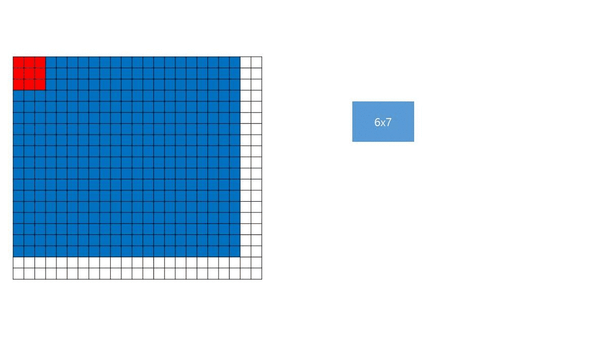

## ConvNets input size constraints

  

## Cat bounding box

  

## Q. 발표장표 12장 표에서 layer5 post-pool 3x3부분이 convolution과 동일한 것일까요?
  A. 아닙니다.
  
  Layer 5 pre-pool부분의 featuremap 사이즈에서 Layer5 post-pool사이에 아래와 같은 연산이 이루어지게 됩니다.
  
  1. pooling을 수행하는 좌표에서 shift하여 추가적인 pooling을 수행하는 방법을 제시 (논문상에서는 : 기준좌표에서 x,y방향으로 {0,1,2}만큼 shift한 좌표의 조합)
  2. pooling 되지 않은 feature map에 pixel offset {0, 1, 2}의 조합에 따라 3x3 max pooling(non-overlapping)을 적용

따라서 scale 2의 Layer5 pre-pool을 기준으로 20x23일때

          (0,0) pixel offset : 3x3pooling을 non overlapping으로 한바퀴를 돌리게되면 6x7크기의 featuremap
          (0,1) pixel offset : 3x3pooling을 non overlapping으로 한바퀴를 돌리게되면 6x7크기의 featuremap
          ...
          (2,2) pixel offset : 3x3pooling을 non overlapping으로 한바퀴를 돌리게되면 6x7크기의 featuremap
          
          
이렇게 모든 offset크기만큼 띄운뒤 pooling작업을 진행하게되면 모든 부분에 해당하는 featuremap(6x7)x(3x3)을 얻을 수 있게 됩니다.

(즉 표에서 6x7은 output feature map size, 3x3은 offset에 해당하는 featuremap개수에 해당합니다.)

